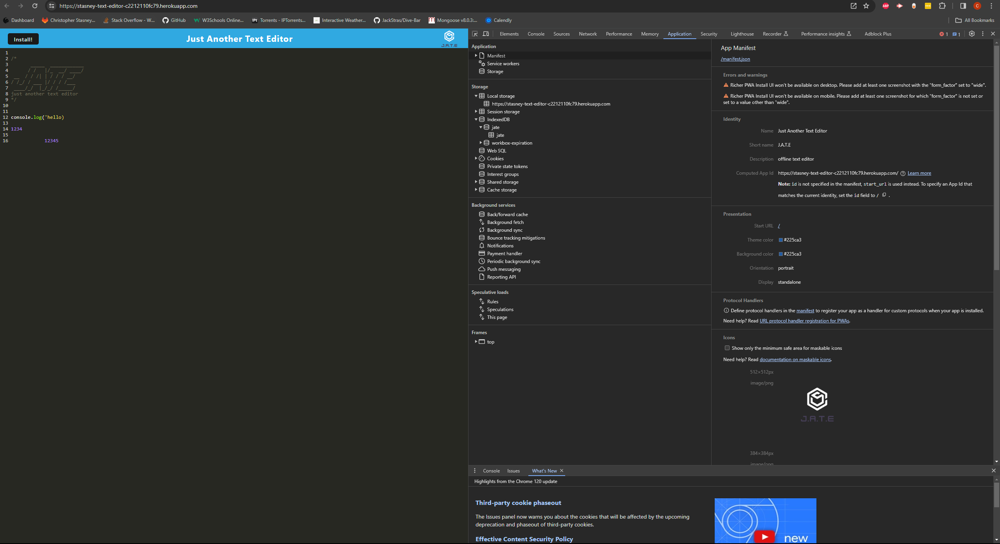
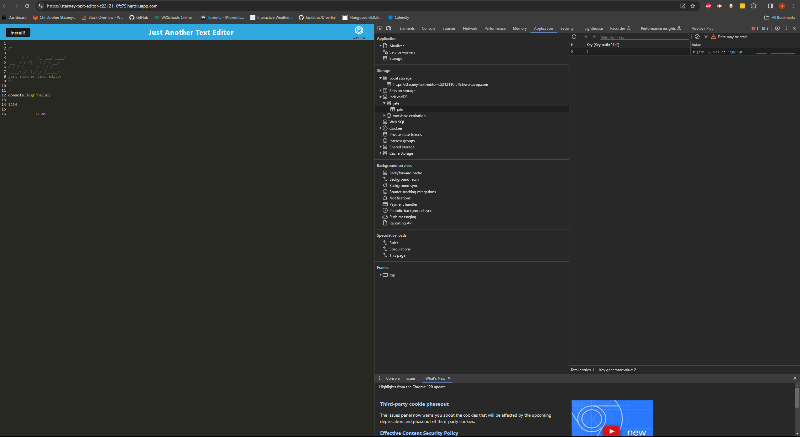

# PWA-Text-Editor

<p align="center">
    
    
    
</p>


## Table of Contents
- [Description](#description)
- [User Story](#user-story)
- [Acceptance Criteria](#acceptance-criteria)
- [Installation](#installation)
- [Screenshots](#screenshots)
- [Deployed](#deployed)
- [Contributing](#contributing)
- [Questions](#questions)

## Description

🪧 This is a PWA text editor application that allows users to create notes or code snippets and retrieve them later on any device and while offline.


## User Story

```md
AS A developer
I WANT to create notes or code snippets with or without an internet connection
SO THAT I can reliably retrieve them for later use
```

## Acceptance Criteria

```md
GIVEN a text editor web application
WHEN I open my application in my editor
THEN I should see a client server folder structure
WHEN I run `npm run start` from the root directory
THEN I find that my application should start up the backend and serve the client
WHEN I run the text editor application from my terminal
THEN I find that my JavaScript files have been bundled using webpack
WHEN I run my webpack plugins
THEN I find that I have a generated HTML file, service worker, and a manifest file
WHEN I use next-gen JavaScript in my application
THEN I find that the text editor still functions in the browser without errors
WHEN I open the text editor
THEN I find that IndexedDB has immediately created a database storage
WHEN I enter content and subsequently click off of the DOM window
THEN I find that the content in the text editor has been saved with IndexedDB
WHEN I reopen the text editor after closing it
THEN I find that the content in the text editor has been retrieved from our IndexedDB
WHEN I click on the Install button
THEN I download my web application as an icon on my desktop
WHEN I load my web application
THEN I should have a registered service worker using workbox
WHEN I register a service worker
THEN I should have my static assets pre cached upon loading along with subsequent pages and static assets
WHEN I deploy to Heroku
THEN I should have proper build scripts for a webpack application
```

## Installation
💿 Open your terminal and install all packages with `npm i`. Then start the application with `npm run start`

## Screenshots

Manifest.json file:


indexedDB:


service-worker:


## Deployed
[Heroku](https://stasney-text-editor-c2212110fc79.herokuapp.com/)

## Contributors
[Christopher Stasney](https://github.com/cstasney)

## Questions
📧 Please reach out with any questions or concerns: [E-mail](mailto:cstasney07@gmail.com) , [GitHub](https://github.com/cstasney)<br />